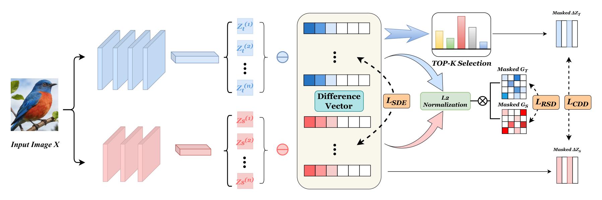

# SDE: Scale-Difference Evolution Knowledge Distillation


> **"SDE: Scale-Difference Evolution Knowledge Distillation"**  
> Xingzhu Liang, Hejie Lu, Yu-e Lin  
> *Anhui University of Science and Technology*  
> \[[Paper Link](https://github.com/JSJ515-Group/SDE)] 

## Introduction

Logit-based knowledge distillation (KD) commonly relies on static prediction alignment, which overlooks the semantic evolution process across different feature scales. To address this limitation, we propose **Scale-Difference Evolution distillation (SDE)**, a novel framework that models the transition dynamics between multi-scale logits through scale-difference representations.

SDE consists of two complementary modules:
*   **Category-Dominant Difference (CDD):** Captures dominant category evidence evolution via a Top-K attention mask.
*   **Relational Structure Difference (RSD):** Preserves inter-class relational consistency during cross-scale semantic transitions.

By jointly modeling category-sensitive evolution and structural semantic relations, SDE enables the student network to inherit richer semantic transition knowledge from the teacher model.

### Framework

*(See Figure 2 in the paper for the detailed framework)*

### Main Results

SDE consistently outperforms state-of-the-art methods across multiple benchmarks:

| Dataset | Performance Highlights |
| :--- | :--- |
| **CIFAR-100** | Consistent **>1%** gains across identical and heterogeneous architectures compared to standard baseline KD methods. |
| **CUB-200** | Achieves a significant **8.10%** accuracy boost on this fine-grained benchmark. |
| **Others** | Strong generalizability demonstrated on Tiny-ImageNet-200 and Stanford Cars datasets. |

---

## Installation

**Recommended Environment:**
*   Python 3.8+
*   PyTorch ≥ 1.10
*   torchvision ≥ 0.11

Clone the repository and install the dependencies:

```bash
git clone [https://github.com/JSJ515-Group/SDE.git](https://github.com/JSJ515-Group/SDE.git)
cd SDE
# Optional: pip install -r requirements.txt
```
Quick Start
We have consolidated all the necessary commands for downloading resources and running SDE distillation across our evaluated datasets.

1. Prepare Pretrained Models & Datasets
CIFAR-100:
Download and save the pretrained teacher models to save/models by running:

Bash
sh fetch_pretrained_teachers.sh
Tiny-ImageNet-200:

Download the dataset from ImageNet.

Place it into ./data/tiny-imagenet-200 (or create a soft link to your local path).

CUB-200:

Download the pretrained teacher model via BaiduYun.

Move the downloaded cub200 folder into the save/ directory.

2. Run Distillation
Example command for running CIFAR-100 (distilling from ResNet50 to ShuffleNetV1):

Bash
python train.py \
  --cfg configs/cifar100/sde/res50_shuv1.yaml \
  --gpu 1 \
  --M [1,2,4] \
  --w_top 1.0 \
  --w_rel 1.0 \
  --top_k 5
Visualization Tools
To better understand the feature evolution, this repository provides scripts for visualizing model representations:

Grad-CAM: Generates attention heatmaps to observe focal regions.

t-SNE: Visualizes high-dimensional feature embeddings.

(Note: Run the visualization scripts located in the visualization directory, e.g., python visualize.py --type gradcam)

Citation
If you find this project useful for your research, please consider citing our paper:

```bibtex
@inproceedings{liang2026sde,
  title={SDE: Scale-Difference Evolution Knowledge Distillation},
  author={Liang, Xingzhu and Lu, Hejie and Lin, Yu-e},
  booktitle={Proceedings of the 32nd ACM SIGKDD Conference on Knowledge Discovery and Data Mining V.2},
  year={2026},
  doi={10.1145/3770855.3817846}
}
```

Contributing
We welcome pull requests and issue submissions to improve the project. Feel free to open an issue if you have any questions.

License
This project is released under the Apache 2.0 License.